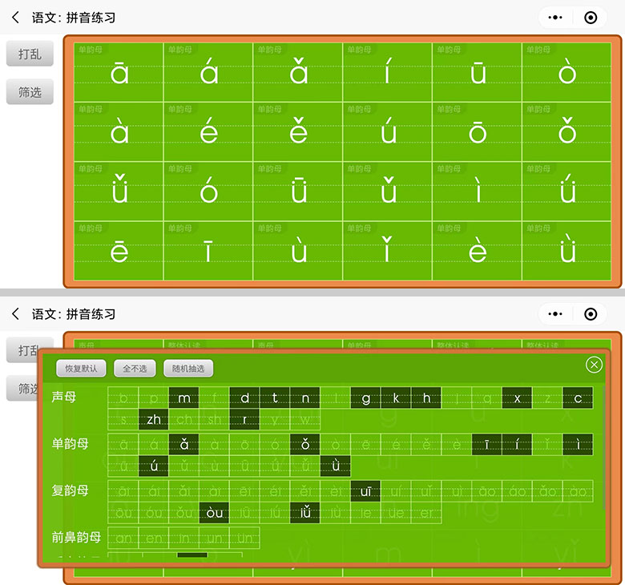
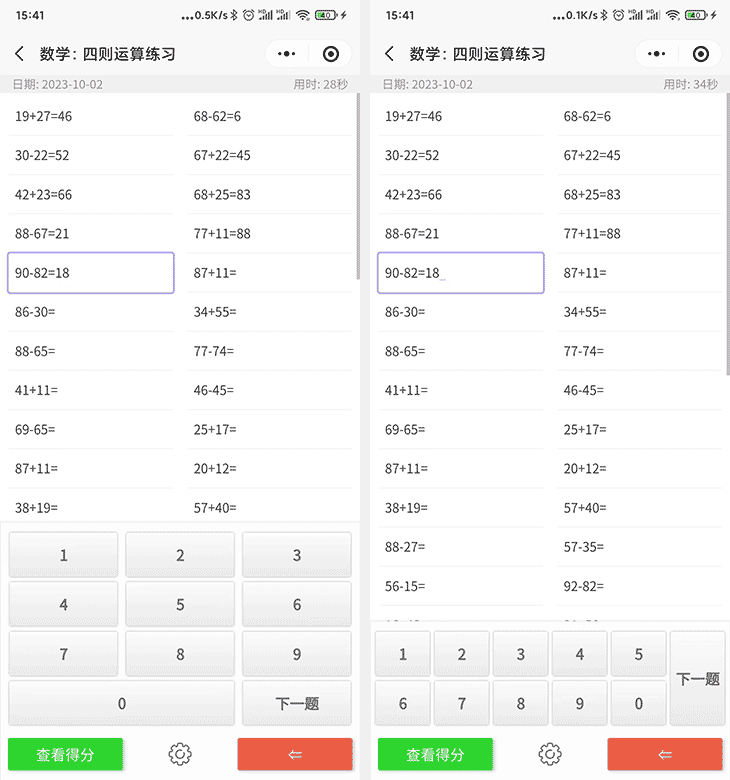
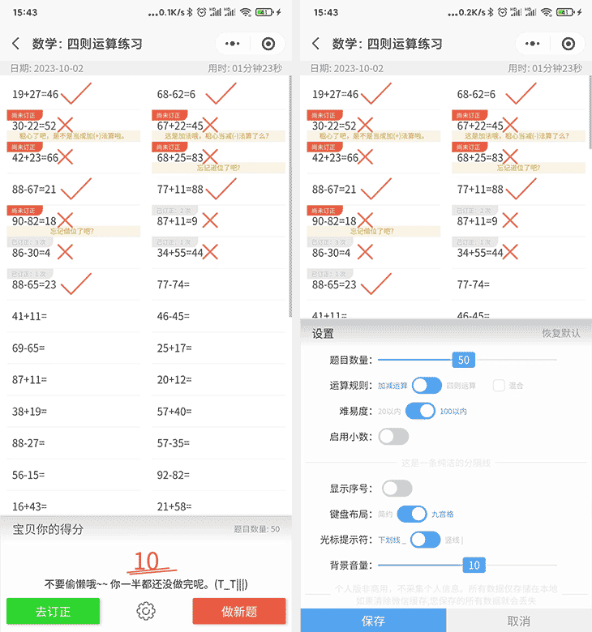
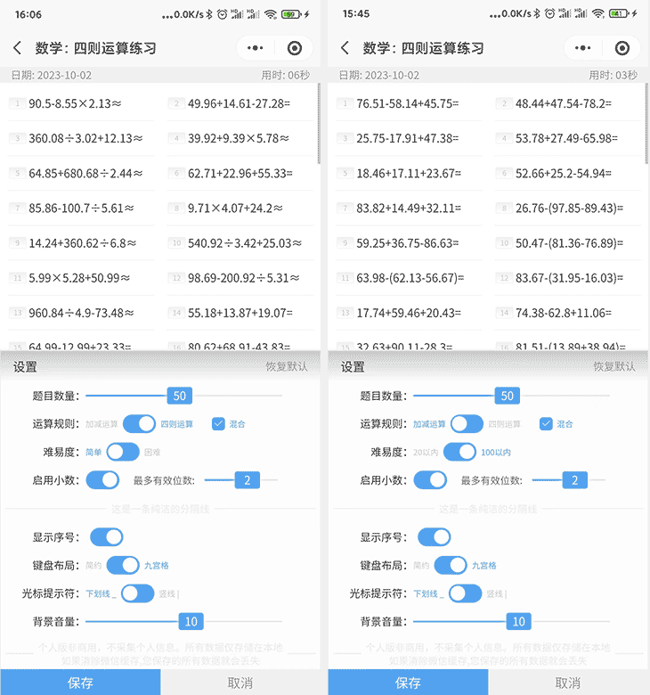
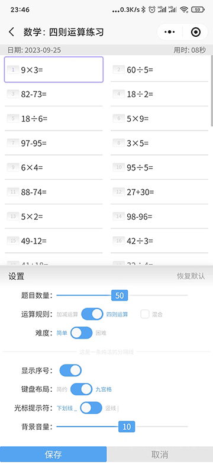
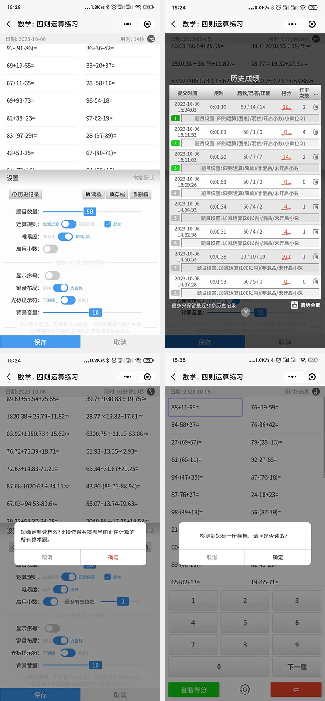

# 小学语文数学练习(微信小程序)
> 本来这小玩意是写给我闺女玩的, 没打算开源，受交流群的筒子们邀请开源，  
> 于北京时间 2023-9-23 17:15 在 [GITHUB&copy;](https://github.com/toviLau/yuwen) 与 [码云&copy;](https://gitee.com/tovilau/yuwen) 同步开源, 欢迎共同交流学习找BUG  
> 
> 如果您有好的 idea 请踊跃给出 issues, 我将选择性采纳。  
> 最后如您喜欢，点个小星星啦 Y\^_\^Y
> 

  

### 开源仓库同步

  　　
 

目前有两功能模块 

### 语文
> 拼音认读练习，反复训练，助力孩子掌握汉语拼音。  

**1. 目前拼音声音素材来源网络，若有侵权请联系我**  
**2. 并全网征集更优秀的拼音素材，如有提供资源的朋友请与我联系**  

 

 
 
### 数学 
> 四则运算练习，帮助孩子们训练大脑，提升小学阶段数学计算力  

#### 两种键盘下答题ing...  
  
  

#### 查看得分 -> 出成绩 与相关配置  
  
  

#### 设置: `加减运算`、`四则运算`、`混合运算`、`小数`、`题目数量`等，配置灵活，可根居孩子的实际学校的课程情况自由选择  
  
  

#### 设置: 在小数与非小数的情况下简约与九宫格键盘
  
  

#### 设置: 历史记录、存档、读档
  
  
