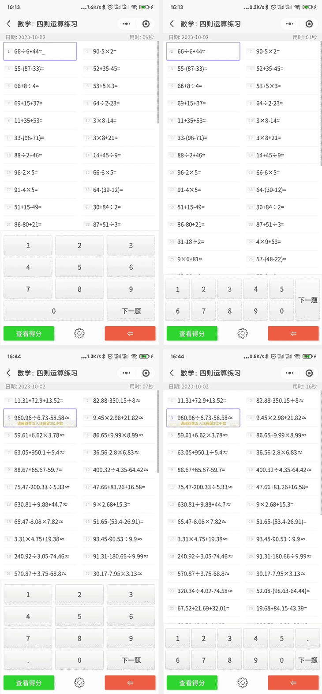

# 小学语文数学练习(微信小程序)
> 本来这小玩意是写给我闺女玩的, 没打算开源，受交流群的筒子们邀请开源，  
> 于北京时间 2023-9-23 17:15 在 [GITHUB&copy;](https://github.com/toviLau/yuwen) 与 [码云&copy;](https://gitee.com/tovilau/yuwen) 同步开源, 欢迎共同交流学习找BUG  
> 
> 如果您有好的 idea 请踊跃给出 isuse, 我将选择性采纳。  
> 最后如您喜欢，点个小星星啦 Y\^_\^Y
> 

  

### 开源仓库同步

  　　
 

目前有两功能模块 

### 语文
> 拼音认读练习，反复训练，助力孩子掌握汉语拼音。  
> **目前拼音没有人声,因为没有声音素材, 全网征集拼音素材，愿意提供合法资源的朋友请与我联系**  

 

 
 
### 数学 
> 四则运算练习，帮助孩子们训练大脑，提升小学阶段数学计算力  

`*以下未说明的是默认配制*`

#### 答题ing...  
  
  

#### 查看得分 -> 出成绩  
  
  

#### 设置: 背景音量3  
  
  

#### 设置: 背景音量10, 四则运算 > 简单, 显示序号  
  
  

#### 设置: 背景音量3, 四则运算 > 困难  
  
  

#### 设置: 背景音量3, 四则运算 > 困难, 题目数量10  
  
  

#### 设置: 显示序号, 四则运算 > 简单, 混合  
  
