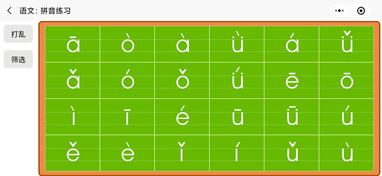
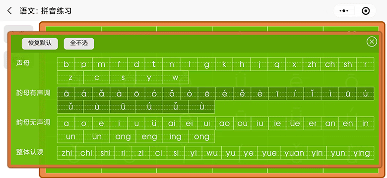
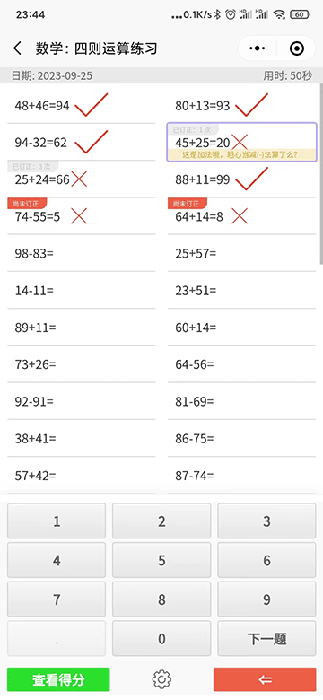
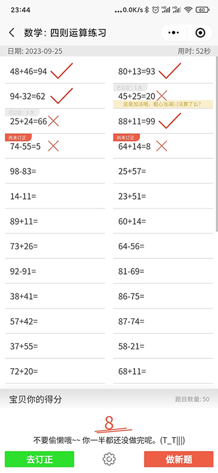
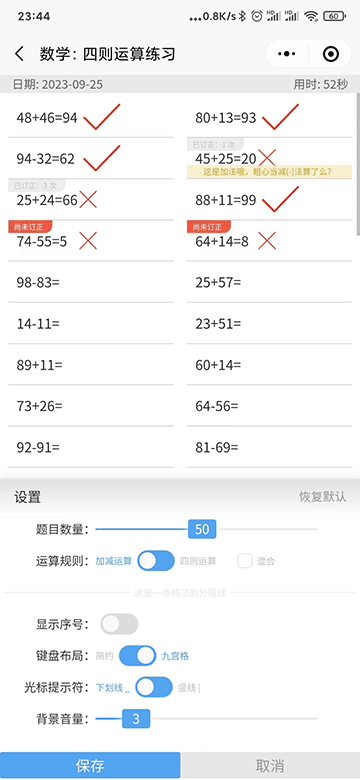

# 小学语文数学练习
> 本来这小玩意是写给我闺女玩的, 没打算开源，授交流群的筒子们邀请开源，  
> 本仓库于北京时间 公元2023-9-23 17:15开源, 共同交流学习找BUG

  

目前有两功能模块 

### 语文
> 拼音认读练习，反复训练，助力孩子掌握汉语拼音。

 

 
 
### 数学 
> 四则运算练习，帮助孩子们训练大脑，提升小学阶段数学计算力

 
 
 